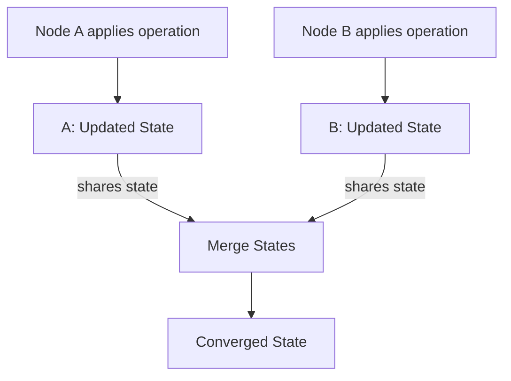

# State-based CRDTs (CvRDTs)

**State-based CRDTs**, also known as **CvRDTs** (Convergent Replicated Data Types), are a class of CRDTs that use a **full-state synchronization** approach.  
They merge states by applying a **join** operation, which combines the states of different replicas without requiring direct coordination.

This model ensures **eventual consistency** while tolerating temporary differences across replicas.

## Properties of CvRDTs

CvRDTs rely on several important mathematical properties:

- **Implemented as a Semilattice:** A partially ordered set equipped with a join operation.
- **Idempotent:** Applying the join operation multiple times has no additional effect.
- **Commutative:** The order of merging does not matter (e.g., A join B = B join A).
- **Associative:** Grouping of merges does not affect the outcome (e.g., (A join B) join C = A join (B join C)).
- **Monotonic:** States can only grow or stay the same; they cannot shrink.
- **Convergence:** All replicas will eventually reach the same state after applying all updates.

## Examples of CvRDTs

- **G-Counter (Grow-Only Counter):** A counter where each replica can independently increment its value. Used in systems that need distributed, conflict-free counters (e.g., like counts across servers).
- **G-Set (Grow-Only Set):** A set where elements can be added but not removed. Useful for distributed tagging or membership systems.
- **OR-Set (Observed-Remove Set):** A set that supports both adds and removes, using unique identifiers to track and resolve concurrent operations.

## Merge Rule

The merge rule for CvRDTs is based on finding the **Least Upper Bound (LUB)** of two states:

- The merged state must be greater than or equal to both input states (C >= A and C >= B).
- It must be the **smallest** state satisfying this condition.
- Mathematically, the merged state is expressed as:  
  `C = A join B`


In simpler terms: merging two states should create a new state that includes all information from both, without duplication or contradiction.

## Trade-offs

- **Simplicity:** Easy to reason about and implement, since merging only requires the join operation.
- **High Bandwidth Usage:** Full-state synchronization can be expensive for large data structures.
- **Higher Latency:** Synchronizing full states can introduce delays, particularly over slow or high-latency networks.
- **Best Use Cases:** Ideal for systems where the data structures are relatively small, or where network bandwidth and latency are not major concerns.

## Reading Suggestions

- [A Comprehensive Study of CRDTs (INRIA)](https://hal.inria.fr/inria-00555588/document) — Section 3 covers CvRDTs in detail.
- [CRDT.tech — CvRDT Section](https://crdt.tech/#cvrdts)

## Operation-Based CRDTs (CmRDTs)

**Operation-based CRDTs**, also known as **CmRDTs** (Commutative Replicated Data Types), are a class of CRDTs that focus on propagating **operations** rather than full states.  
Instead of synchronizing entire objects, replicas exchange individual operations, leading to more efficient communication and reduced bandwidth usage.

CmRDT replicas are guaranteed to converge if:
- Operations are disseminated through **reliable causal broadcast (RCB)** middleware.
- Operations are designed to be **commutative** for concurrent updates.

### Reliable Causal Broadcast (RCB)

Most CmRDTs require **causal delivery order** for update operations.  
Causal delivery can be trivially achieved with a **totally ordered event log**; however:
- If the event log is replicated (e.g., a Kafka topic partition), it introduces coordination overhead.
- If it is not replicated, it becomes a single point of failure.

Thus, **relying on a totally ordered event log** can limit the availability of a CmRDT, which contradicts the high-availability goals of distributed systems.

### Properties of CmRDTs

CmRDTs rely on several important properties to guarantee safe and correct convergence:

- **Causal Delivery:**  
  Operations must be delivered in causal order to ensure consistent state transitions.
  > simply: if update A arrives before update B, then B must be applied after A.

  **Definition 5 (Causal History, op-based):**  
  An object's causal history `C = {c₁, ..., cₙ}` is defined as follows:
  - Initially, `c⁰ᵢ = ∅` for all `i`.
  - If the `k`-th method execution at `i` is:
    - (i) A query `q` or a prepare-update `t`, then the causal history remains unchanged:  
      `cᵏᵢ = cᵏ⁻¹ᵢ`
    - (ii) An effect-update `uᵏᵢ(a)`, then the causal history updates to:  
      `cᵏᵢ = cᵏ⁻¹ᵢ ∪ {uᵏᵢ(a)}`
  > Simply: the causal history of a replica is the set of all operations that have been applied to it.
  > - Every replica has an initial empty causal history.
  > - If you’re just reading the state or preparing an update that doesn’t change the state, the causal history remains unchanged.
  > - If you apply an update that changes the state, you add that update to the causal history in the order it should be applied.


- **Idempotent Operations:**  
  Applying the same operation multiple times has no additional effect.

- **Commutative Operations:**  
  The order of applying operations does not affect the outcome.

- **Associative Operations:**  
  Grouping of operations does not impact the final result.

- **Convergence:**  
  All replicas eventually reach the same state after applying all operations.


### Two-Phase Operation Execution

The execution of a CmRDT operation occurs in two distinct phases:

1. **Prepare Phase:**
    - The operation is prepared into a form that can be transmitted to other replicas.
    - This may involve validation, checking preconditions, or generating unique identifiers.
2. **Effect Phase:**
    - The operation is applied to the local replica’s state.
    - This phase ensures that operations are **idempotent** and **commutative**, allowing safe concurrent updates without conflicts.
```mermaid
stateDiagram-v2
[*] --> S0: Initial State

S0 --> S1: Apply f(x1)
S0 --> S2: Apply g(x2)
S0 --> S3: Apply g(x3)

S1 --> S4: Apply g(x2)
S1 --> S5: Apply g(x3)

S2 --> S4: Apply f(x1)
S2 --> S6: Apply g(x3)

S3 --> S5: Apply f(x1)
S3 --> S6: Apply g(x2)

S4 --> Final: All operations applied
S5 --> Final
S6 --> Final
 ```

### Relation to Event Sourcing

CmRDTs closely resemble **event-sourced architectures**, particularly in how operations are handled:

- **Prepare Phase ↔ Command Handling:**
  - In event sourcing, an incoming command is validated and, if successful, emits an event representing the command’s effect.
  - Similarly, in CmRDTs, the prepare phase produces an operation that encapsulates the intended state change.

- **Effect Phase ↔ Event Handling:**
  - In event sourcing, the emitted event is consumed to update the entity’s state.
  - In CmRDTs, the effect phase applies the prepared operation to the local state.

This relationship highlights that **event sourcing naturally fits an operation-based replication model**, where each replica replays a sequence of causally ordered operations (events) to maintain consistency.


## Examples of Operation-Based CRDTs

### PN-Counter (Positive-Negative Counter)

- A **PN-Counter** is implemented as two G-Counters: one for increments, one for decrements.
- Each replica tracks both increment and decrement operations separately.
- To get the counter-value:  
  `value = (sum of increments) - (sum of decrements)`
- **Operations:**
  - Increment by 1
  - Decrement by 1
- **Properties:**
  - Each operation is idempotent and commutative.

### RGA (Replicated Growable Array)

- An **RGA** is a CRDT designed for ordered lists, useful for collaborative text editing.
- Each element is assigned a unique identifier based on causality.
- **Operations:**
  - Insert after a given element
  - Delete an element
- **Properties:**
  - Insertions and deletions are causally ordered.
  - Concurrent inserts at the same position are resolved deterministically (e.g., by timestamp).

### Reading suggestions
- [CRDT.tech](https://crdt.tech/)
- [A Comprehensive Study of CRDTs](https://hal.inria.fr/inria-00555588/document) — Section 4
- [Redis Blog CRDT](https://redis.io/blog/diving-into-crdts/)

## δ-CRDT – Delta-state CRDTs
**Delta-state CRDTs**, or **δ-CRDTs**, are a hybrid model that combines aspects of both CvRDTs and CmRDTs to combine the advantages of both approaches:
- Efficiency: Like operation-based CRDTs, δ-CRDTs transmit only incremental changes (deltas), reducing bandwidth usage.
- Robustness: Like state-based CRDTs, they operate over unreliable communication channels without requiring exactly once delivery. 

### Properties of δ-CRDTs
They are incremental CvRDTs, and thus inherit all the properties of state-based CRDTs. 

### δ-mutators
Functions that return a delta-state, representing the change, which can be used afterwards to update the state.

### Reading Suggestions
- [Delta State Replicated Data Types.](https://arxiv.org/pdf/1603.01529)  
- [CRDT.tech — Papers](https://crdt.tech/papers.html)

---

## Comparison Table

| Aspect                  | CvRDT (State-based)                                                                     | CmRDT (Operation-based)                                                                                                            | δ-CRDT (Delta-state)                                                                                  |
|-------------------------|-----------------------------------------------------------------------------------------|------------------------------------------------------------------------------------------------------------------------------------|-------------------------------------------------------------------------------------------------------|
| **Delivery Guarantees** | Eventual consistency; tolerates message loss, duplication, and out-of-order delivery    | Requires reliable causal broadcast (RCB); operations must be delivered in causal order                                             | Eventual consistency; tolerates message loss, duplication, and out-of-order delivery like CvRDTs      |
| **Payload Size**        | Full state transfer; can be large for complex data structures                           | Small; only operations are transmitted                                                                                             | Partial state (delta); smaller than full state but potentially larger than operations                 |
| **Merge Function**      | Join operation on semilattice; idempotent, commutative, and associative                 | Two-phase execution (prepare and effect); operations must be commutative for concurrent updates                                    | Join operation similar to CvRDTs but applied to delta-states                                          |
| **Pros**                | Simple to reason about; robust against network failures; works over unreliable channels | Bandwidth efficient; lower latency for large states; better performance in high-throughput systems                                 | Combines bandwidth efficiency of CmRDTs with the robustness of CvRDTs; works over unreliable channels |
| **Cons**                | High bandwidth usage for large states; inefficient for frequently changing data         | Requires reliable causal delivery; more complex to implement; potential single point of failure if using totally ordered event log | More complex implementation than pure CvRDTs; potential overhead in managing delta propagation        |

### Why These Tradeoffs Matter

1. **Delivery Guarantees**: 
   - In unreliable networks (like edge computing or mobile devices), CvRDTs and δ-CRDTs are more resilient as they can handle message loss.
   - In controlled environments with reliable infrastructure, CmRDTs may offer better performance but at the cost of requiring more sophisticated message delivery systems.

2. **Payload Size**: 
   - For large data structures (e.g., collaborative documents), sending full states (CvRDTs) can consume excessive bandwidth and increase synchronization time.
   - For applications with limited bandwidth (mobile networks, IoT devices), operation-based (CmRDTs) or delta-based (δ-CRDTs) approaches are more efficient.
   - The choice directly impacts scalability, latency, and operational costs.

3. **Merge Function**: 
   - Simpler merge functions (CvRDTs) are easier to implement correctly but may be less efficient.
   - More complex merge strategies (CmRDTs, δ-CRDTs) can optimize performance but increase the risk of implementation errors.
   - The merge function determines how conflicts are resolved, affecting the user experience in collaborative applications.

4. **Implementation Complexity**: 
   - Higher complexity (CmRDTs, δ-CRDTs) requires more development time and increases the risk of bugs.
   - Simpler models (CvRDTs) may be preferable for critical systems where correctness is paramount.
   - The complexity of the implementation affects maintenance costs and the ability to extend the system.

The optimal CRDT type depends on your specific use case:
- **CvRDTs**: Best for systems where simplicity and robustness are prioritized over bandwidth efficiency.
- **CmRDTs**: Ideal for systems with reliable networks where bandwidth efficiency is critical.
- **δ-CRDTs**: Suitable for systems that need both bandwidth efficiency and tolerance to network failures, especially in edge computing or low-bandwidth environments.
