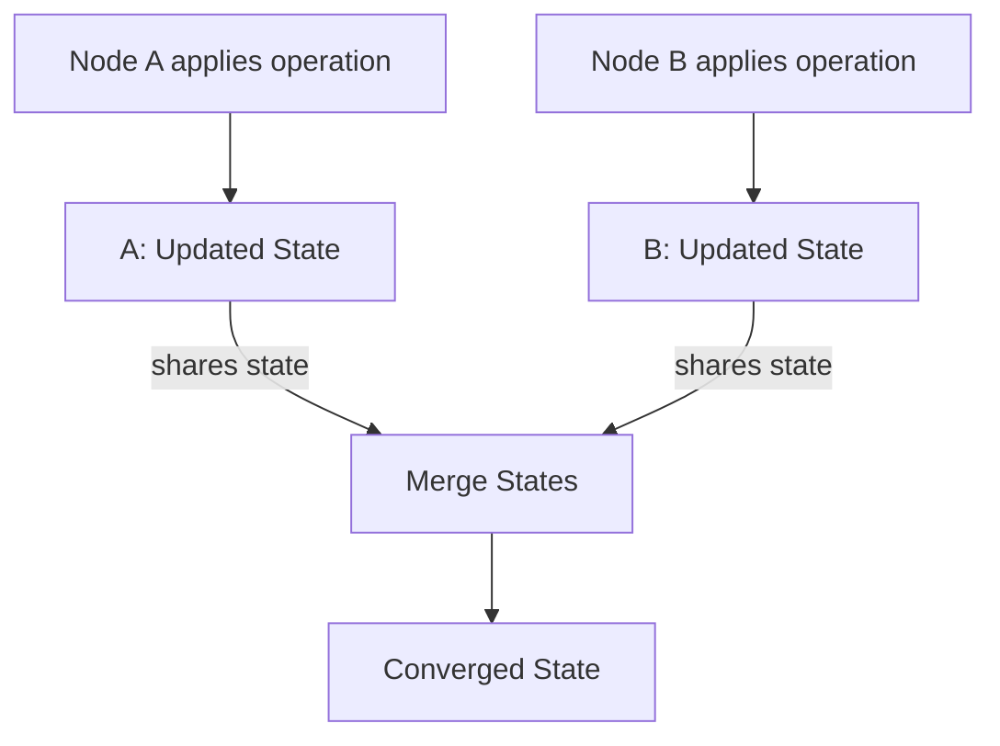

# CvRDT – State-Based CRDTs

**State-based CRDTs**, also known as **CvRDTs** (Commutative Replicated Data Types), are a class of CRDTs that use a **full-state synchronization** approach.  
They merge states by applying a **join** operation, which combines the states of different replicas without requiring direct coordination.

This model ensures **eventual consistency** while tolerating temporary differences across replicas.

## Properties of CvRDTs

CvRDTs rely on several important mathematical properties:

- **Implemented as a Semilattice:** A partially ordered set equipped with a join operation.
- **Idempotent:** Applying the join operation multiple times has no additional effect.
- **Commutative:** The order of merging does not matter (e.g., A join B = B join A).
- **Associative:** Grouping of merges does not affect the outcome (e.g., (A join B) join C = A join (B join C)).
- **Monotonic:** States can only grow or stay the same; they cannot shrink.
- **Convergence:** All replicas will eventually reach the same state after applying all updates.

## Examples of CvRDTs

- **G-Counter (Grow-Only Counter):** A counter where each replica can independently increment its value. Used in systems that need distributed, conflict-free counters (e.g., like counts across servers).
- **G-Set (Grow-Only Set):** A set where elements can be added but not removed. Useful for distributed tagging or membership systems.
- **OR-Set (Observed-Remove Set):** A set that supports both adds and removes, using unique identifiers to track and resolve concurrent operations.

## Merge Rule

The merge rule for CvRDTs is based on finding the **Least Upper Bound (LUB)** of two states:

- The merged state must be greater than or equal to both input states (C >= A and C >= B).
- It must be the **smallest** state satisfying this condition.
- Mathematically, the merged state is expressed as:  
  **C = A join B**

In simpler terms: merging two states should create a new state that includes all information from both, without duplication or contradiction.

## Trade-offs

- **Simplicity:** Easy to reason about and implement, since merging only requires the join operation.
- **High Bandwidth Usage:** Full-state synchronization can be expensive for large data structures.
- **Higher Latency:** Synchronizing full states can introduce delays, particularly over slow or high-latency networks.
- **Best Use Cases:** Ideal for systems where the data structures are relatively small, or where network bandwidth and latency are not major concerns.

## Reading Suggestions

- [A Comprehensive Study of CRDTs (INRIA)](https://hal.inria.fr/inria-00555588/document) — Section 3 covers CvRDTs in detail.
- [CRDT.tech — CvRDT Section](https://crdt.tech/#cvrdts)

## CmRDT – Operation-based CRDTs

> Search for:
> - "CmRDT causal delivery"
> - "operation-based crdt example"
> - "event ordering in CRDTs"

### Your goal:
- Explain how operations are propagated and applied
- Note requirement for **causal and reliable delivery**
- Describe op design: idempotent, commutative ops
- Examples: PN-Counter, RGA
- Pros/cons vs CvRDT

### Reading suggestions:
- [CRDT Primer by Red Planet Labs](https://redplanetlabs.com/blog/2020/04/15/an-introduction-to-conflict-free-replicated-data-types-crdts/)
- [A Comprehensive Study of CRDTs](https://hal.inria.fr/inria-00555588/document) — Section 4

---

## Δ-CRDT – Delta-state CRDTs

> Search for:
> - "delta crdt"
> - "delta-state replication"
> - "deltas vs ops vs full state"

### Your goal:
- Describe what a delta is (minimal change to state)
- Compare merge behavior with CvRDT
- Show why it reduces bandwidth and how it maintains convergence
- Discuss use in edge computing or low-bandwidth environments

### Reading suggestions:
- [Delta CRDTs: Microsoft Research Paper](https://www.microsoft.com/en-us/research/publication/delta-state-crdts/)
- [CRDT.tech — Delta CRDT](https://crdt.tech/#delta-crdts)

---

## Comparison Table

> Create:
> - A matrix/table comparing CvRDT, CmRDT, and Delta-CRDT
> - Compare: delivery guarantees, payload size, merge function, pros/cons

### Your goal:
- Create your *own table*, not mine
- Ensure you understand *why* each tradeoff matters

> Tip: Use Notion or Markdown tables to visualize