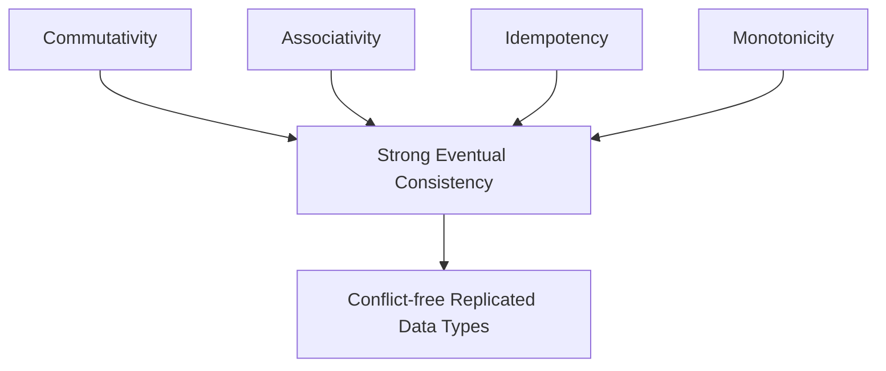

# Common Properties of CRDTs

This document explores the fundamental mathematical properties that make CRDTs work.
These properties ensure that distributed replicas can converge to a consistent state without coordination.

## Commutativity

**Definition**: An operation is commutative if the order of operations doesn't affect the final result.

Mathematically: For any operations A and B, A ⊕ B = B ⊕ A (where ⊕ represents the merge operation)

**Why it matters for CRDTs**:
- Enables concurrent updates from different replicas without coordination
- Allows operations to be applied in any order, simplifying system design
- Eliminates the need for a central authority to determine operation order

**Examples in CRDTs**:
- In a G-Counter (Grow-only Counter), increments from different replicas can be applied in any order
- In a G-Set (Grow-only Set), adding elements A then B produces the same result as adding B then A
- In CvRDTs, the join operation must be commutative to ensure convergence

## Associativity

**Definition**: An operation is associative if the grouping of operations doesn't affect the final result.

Mathematically: For any operations A, B, and C, (A ⊕ B) ⊕ C = A ⊕ (B ⊕ C)

**Why it matters for CRDTs**:
- Enables incremental synchronization between replicas
- Allows replicas to merge states in any sequence
- Ensures that partial merges produce correct results

**Examples in CRDTs**:
- In a distributed system, if replica A merges with B, and then with C, the result should be the same as if A had merged with the result of B and C merging first
- In set-based CRDTs, combining sets (A ∪ B) ∪ C equals A ∪ (B ∪ C)
- Enables efficient peer-to-peer synchronization without central coordination

## Idempotency

**Definition**: An operation is idempotent if applying it multiple times has the same effect as applying it once.

Mathematically: For any state S and operation A, A (A (S)) = A (S)

**Why it matters for CRDTs**:
- Ensures resilience against message duplication in distributed systems
- Simplifies recovery from network failures
- Allows for retry mechanisms without side effects

**Examples in CRDTs**:
- In a G-Set, adding the same element multiple times has the same effect as adding it once
- In CvRDTs, applying the same merge operation repeatedly doesn't change the result
- Enables safe re-delivery of messages in unreliable networks

## Monotonicity

**Definition**: A system is monotonic if its state can only grow (according to some partial order) and never regress.

Mathematically: If S₁ is a state that transitions to S₂, then S₁ ≤ S₂ (where ≤ represents a partial order relation)

**Why it matters for CRDTs**:
- Ensures that the system always progresses toward convergence
- Prevents "lost updates" or oscillating states
- Provides a formal basis for reasoning about eventual consistency

**Examples in CRDTs**:
- In a G-Counter, the counter-value can only increase, never decrease
- In CvRDTs, states form a semilattice where the join operation always produces a state that is greater than or equal to both input states
- In version vectors, the logical clock for each replica can only advance forward

## Strong Eventual Consistency (SEC)

**Definition**: Strong Eventual Consistency guarantees that replicas that have received the same set of updates will be in the same state, regardless of the order in which they received those updates.

**Why it matters for CRDTs**:
- Provides stronger guarantees than basic eventual consistency
- Ensures deterministic convergence without requiring consensus
- Enables formal verification of distributed system behavior

**Components of SEC**:
1. **Eventual Delivery**: Updates made at one replica are eventually delivered to all replicas
2. **Convergence**: Replicas that have received the same updates are in the same state
3. **Termination**: All update operations terminate

**How CRDTs achieve SEC**:
- By ensuring operations are commutative, associative, and idempotent
- By using monotonic semilattices in state-based CRDTs
- By enforcing causal delivery in operation-based CRDTs

## How These Properties Work Together

These properties form the mathematical foundation that enables CRDTs to function correctly in distributed environments:

- **Commutativity** and **Associativity** ensure that operations can be applied in any order and grouped in any way
- **Idempotency** ensures resilience against message duplication
- **Monotonicity** ensures that the system always progresses toward convergence
- Together, these properties enable **Strong Eventual Consistency** without requiring coordination

## Real-world Implications

Understanding these properties helps system designers:
1. Choose the right CRDT for specific use cases
2. Implement custom CRDTs correctly
3. Reason about system behavior under various network conditions
4. Optimize performance while maintaining correctness
5. Debug issues in distributed applications

By leveraging these mathematical properties,
CRDTs provide a powerful framework
for building distributed systems that are both highly available and eventually consistent.
